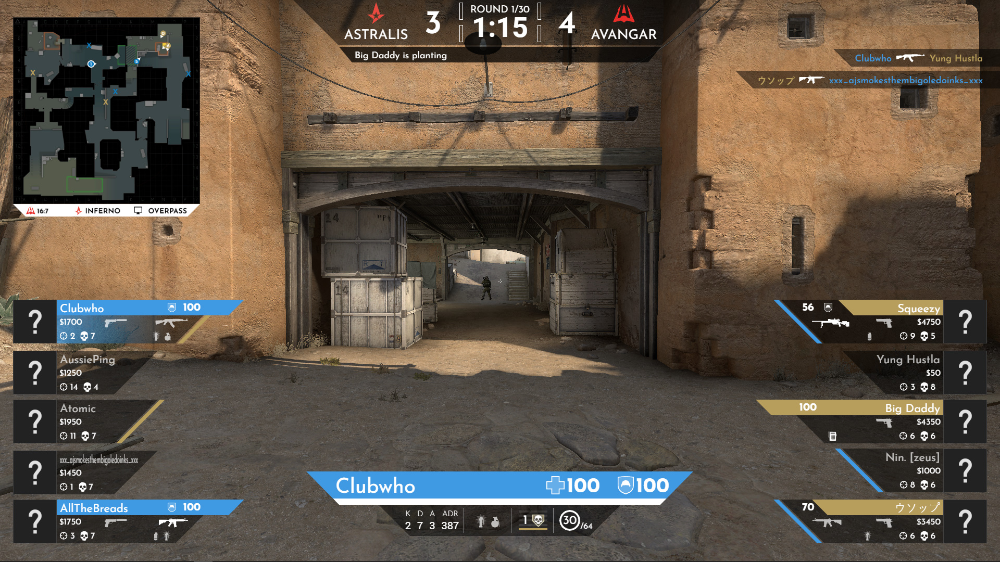

# Basic CSGO Graphics


Basic CSGO HUD that I designed to be basic enough so that you can modify it.

## Getting Started

These instructions will get you a copy of the project up and running on your local machine for development and testing purposes. See deployment for notes on how to deploy the project on a live system.

### Prerequisites

* [NodeCG](https://www.nodecg.dev/)
* [NodeCG CSGO Manager](https://github.com/EwanLyon/nodecg-csgo-manager)

For killfeed and player firing indicators on the mini map:

* [HLAE](https://www.advancedfx.org/download/) I recommed understanding what this program does if you haven't used it before

### Installing

A GitHub action is planned to be made. Currently you have to manually build

1. Clone the repo into the NodeCG bundles folder

   ```sh
   cd nodecg/bundles
   git clone https://github.com/EwanLyon/basic-csgo-graphics.git
   ```

2. Install NPM packages

   ```sh
   npm install
   ```

3. Run build

   ```sh
   npm run build
   ```

4. Start NodeCG

   ```sh
   npm run start
   ```

   or

   ```sh
   cd ../..
   node .
   ```

5. (Optional) If running HLAE type into the CSGO console

    ```sh
    mirv_pgl events whitelist add "player_death"
    mirv_pgl events whitelist add "other_death"
    mirv_pgl events whitelist add "weapon_fire"
    mirv_pgl url "ws://localhost:31337/mirv"
    mirv_pgl start
    ```

<!-- ROADMAP -->
## Roadmap

Currently a lot of code cleanup needs to occur. Expect changes to occur rapidly and break bundles using this.

See the [open issues](https://github.com/EwanLyon/clubwho-csgo-graphics/issues) for a list of proposed features (and known issues).

## Built With

* [NodeCG](https://www.nodecg.dev/)
* [NodeCG CSGO Manager](https://github.com/EwanLyon/nodecg-csgo-manager)
* [TypeScript](https://www.typescriptlang.org/)
* [React](https://reactjs.org/)
* [Redux](https://redux.js.org/)
* [Styled Components](https://styled-components.com/)

<!-- CONTRIBUTING -->
## Contributing

Contributions are what make the open source community such an amazing place to be learn, inspire, and create. Any contributions you make are **greatly appreciated**.

1. Fork the Project
2. Create your Feature Branch (`git checkout -b feature/AmazingFeature`)
3. Commit your Changes (`git commit -m 'Add some AmazingFeature'`)
4. Push to the Branch (`git push origin feature/AmazingFeature`)
5. Open a Pull Request

## License

This project is licensed under the MIT License - see the [LICENSE](LICENSE) file for details
